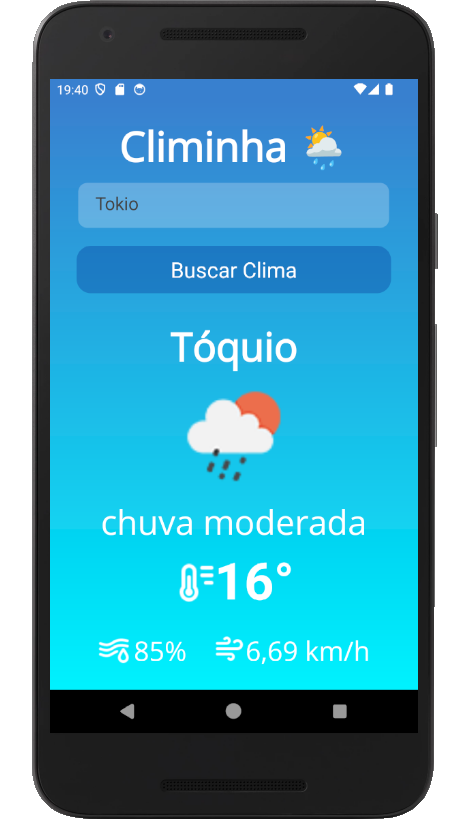

# Climinha ☀️🌧️

**Climinha** é um aplicativo simples de previsão do tempo desenvolvido em .NET MAUI, que consome a API do [OpenWeatherMap](https://openweathermap.org/).
Ele exibe informações básicas sobre o clima atual de qualquer cidade do mundo, como temperatura, sensação térmica, condição do tempo, umidade e velocidade do vento.

---

## 🚀 Funcionalidades

- 🔍 Busca por cidade
- 🌡️ Temperatura atual e sensação térmica
- ☁️ Descrição do clima (ensolarado, nublado, chuva etc.)
- 💧 Umidade relativa do ar
- 🌬️ Velocidade do vento
- 🖼️ Ícone representando a condição atual

Funcionalidades futuras planejadas:
- ⏳ Previsão dos próximos dias
- 📍 Geolocalização atual
- ⭐ Salvar cidades favoritas
- ✨ Auto completar de nomes de cidades

---

## 🛠️ Tecnologias Utilizadas

- [XAML + C#](https://learn.microsoft.com/en-us/dotnet/maui/)
- [.NET MAUI](https://dotnet.microsoft.com/en-us/apps/maui)
- [OpenWeatherMap API](https://openweathermap.org/api)

---

## 🖼️ Screenshots



---

## ⚙️ Como usar

1. **Clone o repositório**:

```bash
   git clone https://github.com/naldobr-dev/Climinha.git
   cd Climinha
```

2. **Adicione sua chave da API do OpenWeatherMap**:

   * Na pasta `Resources/Raw`, há um arquivo chamado `secrets.example.json`.
   * Renomeie esse arquivo para `secrets.json`.
   * Substitua o `SUA-CHAVE-AQUI` por sua chave da API obtida em [OpenWeatherMap API](https://openweathermap.org/api):

 ```json
 {
   "OpenWeather": {
     "ApiKey": "SUA-CHAVE-AQUI"
   }
 }
 ```

3. **Compile e execute o projeto**:

   * Requisitos:

     * [.NET 8 SDK](https://dotnet.microsoft.com/en-us/download/dotnet/8.0)
     * Visual Studio 2022 ou superior com suporte ao MAUI instalado

---

## 📄 Licença

Este projeto está licenciado sob a Licença MIT. Veja o arquivo [LICENSE](LICENSE) para mais detalhes.

---

## 🤝 Contribuições

Contribuições são bem-vindas! Sinta-se à vontade para abrir issues, enviar pull requests ou deixar feedbacks.

---

## 👤 Autor

Desenvolvido com dedicação por [@naldobr-dev](https://github.com/naldobr-dev) 💙

